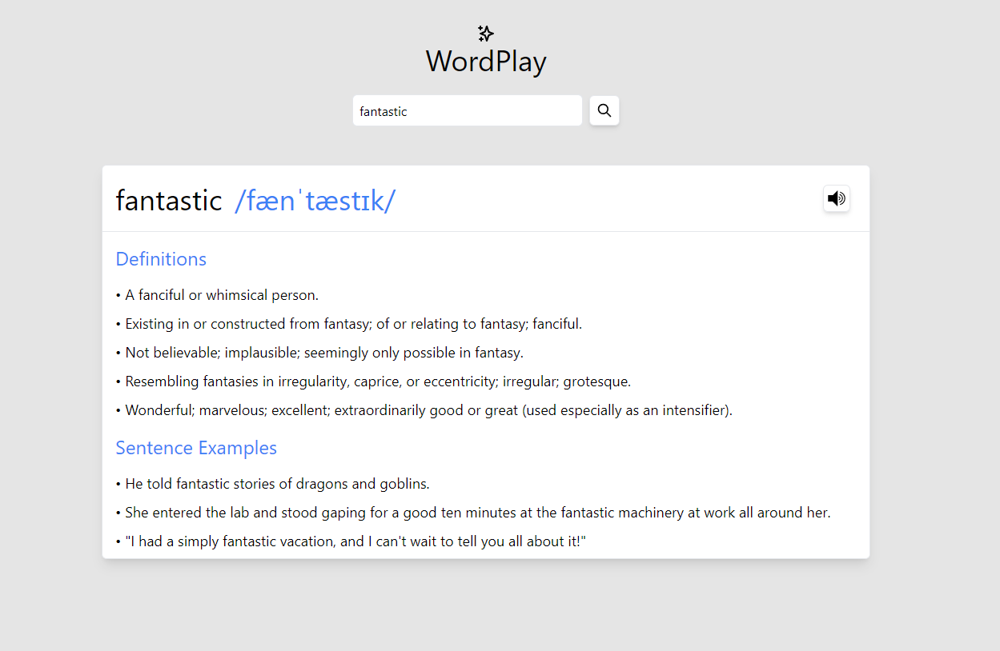

# WordPlay
 Dictionary App made with React and tailwindCSS + Hero Icons\
 [Check out the app live!](http://wordplayace.netlify.app)

 

# About
  WordPlay is a React powered Web app that gives you definitions of any english word using the [Free Dictionary API](https://dictionaryapi.dev/).


# Installation
  - Clone the Repository
  - Run The Following Command to install dependencies
   ```sh
   npm install
   ```
  - To start the application
   ```sh
   npm start
   ```

# Attributions
  Icons used are from [Hero Icons](https://heroicons.com/) and [Game Icons](https://game-icons.net/)
